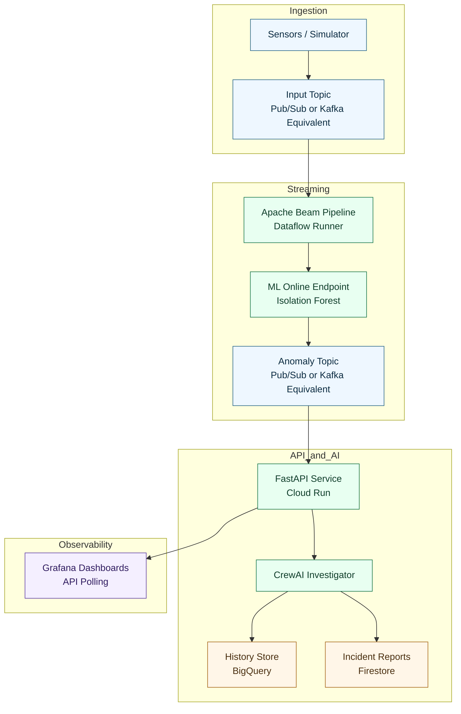

# IoT AI Reliability System

Real-time IoT anomaly detection with automated investigation and dashboarding.

This project ingests telemetry, detects anomalies with an ML model, triggers an LLM-based root-cause summary, and exposes API endpoints for dashboards.

## Why This Exists

Industrial IoT systems generate high-volume sensor data. Teams usually face three issues:

- Too many false alerts mixed with normal variance.
- Slow incident triage and diagnosis.
- Low visibility across operations teams.

This system addresses those issues by combining stream processing, anomaly detection, AI investigation, and API-first observability.

## Service Translation (Cloud-Agnostic)

Use this table if you are familiar with general data/ML platforms but not Google Cloud.

| Capability (generic) | Used in this repo | Comparable concepts elsewhere |
|---|---|---|
| Event streaming / message bus | Cloud Pub/Sub topics (`telemetry-stream`, `anomaly-events`) | Apache Kafka topics, RabbitMQ exchanges |
| Stream processing engine | Apache Beam pipeline (`src/pipeline`) | Apache Flink, Spark Structured Streaming |
| Managed runner for Beam jobs | Cloud Dataflow | Self-managed Beam runner on Kubernetes/YARN |
| Online model inference endpoint | Vertex AI Endpoint | KFServing/KServe, SageMaker Endpoint |
| Object storage for model artifacts | Cloud Storage (GCS) | S3, Azure Blob, MinIO |
| Analytics warehouse for history/training | BigQuery | Snowflake, Redshift, Databricks SQL |
| Operational document store | Firestore | MongoDB, DynamoDB, Cosmos DB |
| Serverless API hosting | Cloud Run | Knative, AWS App Runner/Fargate, Azure Container Apps |
| Build pipeline | Cloud Build | GitHub Actions, GitLab CI, Jenkins |
| Dashboarding | Grafana Cloud | Self-hosted Grafana, Kibana (for visualization use cases) |
| LLM for investigation summaries | Gemini via CrewAI | OpenAI/Anthropic/local LLMs via CrewAI adapters |

Notes:
- Pub/Sub in this project plays the same role Kafka usually plays: decoupled producer-consumer messaging.
- Apache Beam is the programming model; Dataflow is the managed execution service for that Beam pipeline.

## High-Level Flow

1. Sensors (or simulator) publish telemetry events to input topic.
2. Beam pipeline windows events by sensor and performs anomaly scoring using deployed model.
3. Detected anomalies are published to output topic.
4. API receives anomaly push events and starts background investigation with CrewAI.
5. Investigation results are persisted and served to dashboards via API endpoints.

## Architecture



## API Endpoints

- GET /api/anomalies
  - Returns latest investigated anomaly reports.
- GET /api/anomaly-stats?hours=24
  - Returns total and lookback-window counts.
- GET /api/anomaly-trends?hours=24&bucket=1h
  - Returns time-bucketed anomaly counts.
- POST /pubsub/anomaly-push
  - Push endpoint for anomaly events; queues background investigation.

## Project Structure

```text
.
|-- main.py
|-- Dockerfile
|-- Dockerfile.retrain
|-- cloudbuild.yaml
|-- requirements.txt
|-- pipeline-requirements.txt
|-- requirements-retrain.txt
|-- ml/
|   |-- train.py
|   |-- deploy.py
|   |-- retrain.py
|   `-- artifacts/
|-- scripts/
|   `-- simulator.py
|-- src/
|   |-- api/
|   |   |-- app.py
|   |   `-- routes/
|   |-- agents/
|   |   `-- investigator.py
|   |-- pipeline/
|   |   |-- run.py
|   |   `-- transforms.py
|   `-- core/
|       `-- config.py
`-- static/
    `-- index.html
```

## Quick Start

1. Create environment file

- Copy `.env.example` to `.env` and fill required values.

2. Install API dependencies

- pip install -r requirements.txt

3. Train model artifact

- python -m ml.train

4. Deploy model to inference endpoint

- python -m ml.deploy

5. Run streaming pipeline

- Local runner:
  - python -m src.pipeline.run --runner DirectRunner
- Managed Dataflow runner:
  - python -m src.pipeline.run --runner DataflowRunner --project $PROJECT_ID --region $REGION --temp_location gs://$BUCKET_NAME/tmp --requirements_file pipeline-requirements.txt

6. Start API service locally

- uvicorn main:app --host 0.0.0.0 --port 8080

7. Optional: run simulator

- python -m scripts.simulator

## Cloud Run Deployment

Build and deploy the API container:

- Build image:
  - gcloud builds submit --tag gcr.io/$PROJECT_ID/iot-api
- Deploy service:
  - gcloud run deploy iot-api --image gcr.io/$PROJECT_ID/iot-api --region $REGION --platform managed --allow-unauthenticated

The Docker image uses the root `Dockerfile` and serves FastAPI on `$PORT` (default 8080).

## Retraining Job

Manual run:

- python -m ml.retrain

Build retrainer image with Cloud Build config:

- gcloud builds submit --config cloudbuild.yaml .

Typical scheduler options:

- Cloud Scheduler triggering Cloud Run Job or HTTP endpoint.
- Cloud Tasks for queued/asynchronous invocation patterns.

